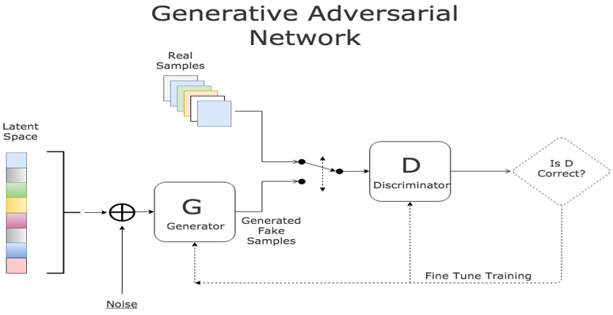
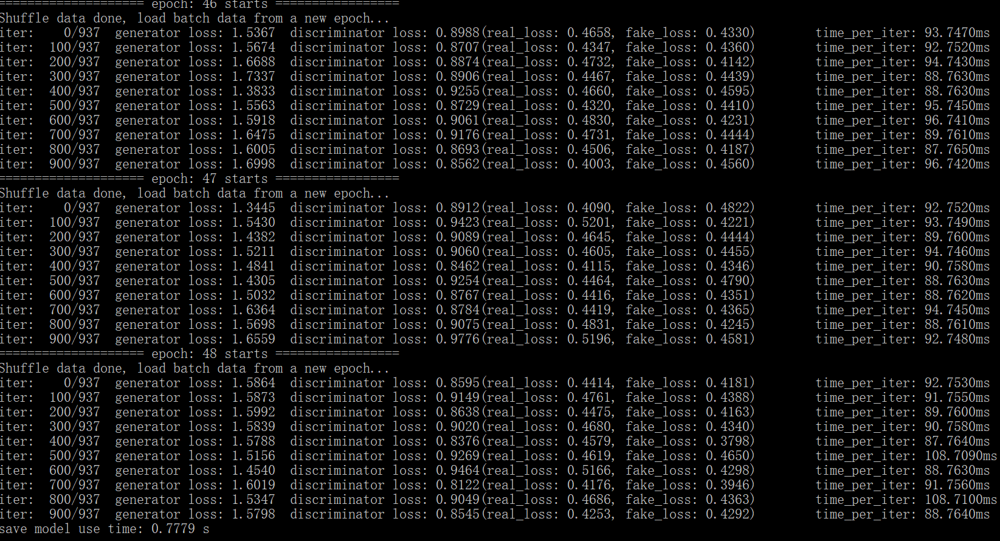
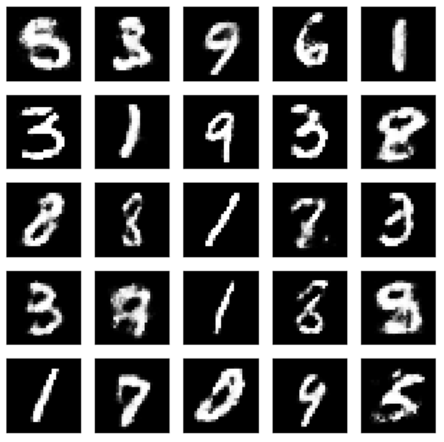

# MicroNet
A simple and extensible neural network framework, which be used for image classification and image generation.



In this repository, I implemented a simple and extensible neural network framework with c++, which can be used flexibly to build image recognition neural networks and sample Generative Adversarial Networks(Gans). It is easy to extend this MicroNet to new data sets and new network structures, as long as you provider new datasets and custom network structure(just like keras). Four optimization algorithms are implemented: SGD, Adam, AdaGrad, RMSProb. 

As a test experiment of this framework, I implemented a simple Lenet5 network.The experimental results of the four optimization algorithms are as follows. It can be seen that Adam has achieved the best test accuracy 99.25% (99.05% in Lecun's original paper [Gradient-Based Learning Applied to Document Recognition](http://yann.lecun.com/exdb/publis/pdf/lecun-98.pdf)). This also reflects the superiority of the Adam algorithm, which is less sensitive to the choice of optimizing superparameters.I also implemented a network with the same configuration using tensorflow. Adam algorithm is used to train the network. The final test accuracy is 99.1%, and the training speed is 28ms/iter(batch size 32), which is faster than my implementation (30ms/iter).

In addition, I also implemented a simple generated adversarial network for generating mnist data. Experimental result shows, the GansNet is implemented correctly and training is stable.


## LeNet5

**accuracy**

**loss**


## Gans

**loss**

**fake mnist images**


## Requirements
- g++ >= 4.7

## Usage
**Step 1.** 
Clone this repository with ``git``.
```
$ git clone https://github.com/VectorFist/MicroNet.git
$ cd MicroNet
```

**Step 2.** 
Download the [MNIST dataset](http://yann.lecun.com/exdb/mnist/), extract it into ``data`` directory.
```
$ sh get_mnist.sh
```

**Step 3.** 
Build and train.
```
$ make
$ ./lenet5
```
