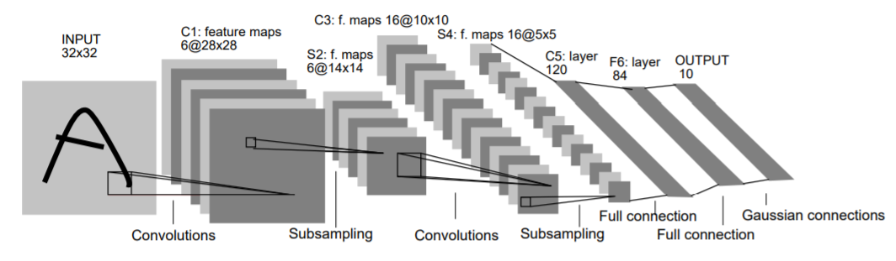
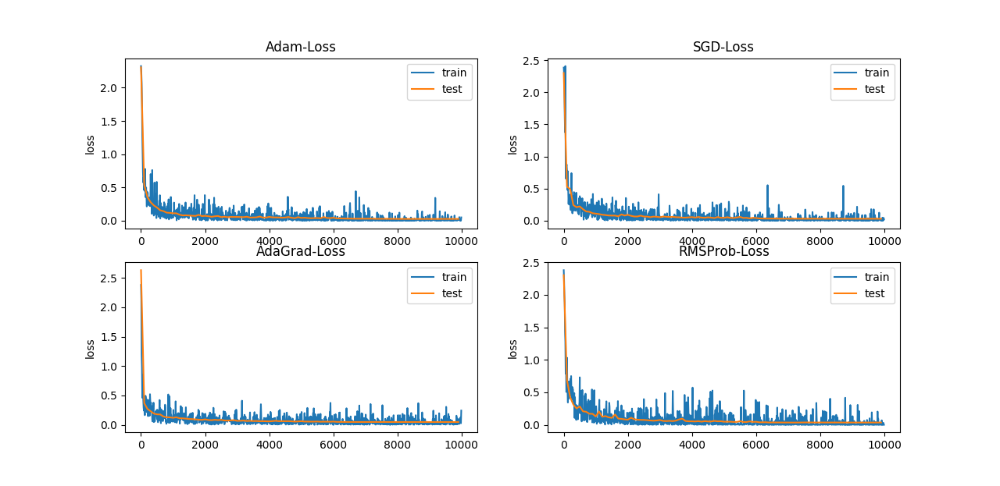

# LeNet5
A Lenet5 C++ implementation without using any deep learning framework.


In this repository, I implemented a simple Lenet5 network with C++, without using any deep learning framework. In particular, I also implemented Focalloss, which is proposed for one-stage dense object detection ([Focal Loss for Dense Object Detection](https://arxiv.org/abs/1708.02002)).Four optimization algorithms are implemented: SGD, Adam, AdaGrad, RMSProb. The experimental results of the four optimization algorithms are as follows. It can be seen that Adam has achieved the best test accuracy 99.15% (99.05% in Lecun's original paper [Gradient-Based Learning Applied to Document Recognition](http://yann.lecun.com/exdb/publis/pdf/lecun-98.pdf)). This also reflects the superiority of the Adam algorithm, which is less sensitive to the choice of optimizing superparameters.

As a comparative experiment, I implemented a network with the same configuration using tensorflow. Adam algorithm is used to train the network. The final test accuracy is 99.1%, and the training speed is 30ms/iter(batch size 32), which is faster than my implementation (40ms/iter).

**accuracy**

**loss**


## Requirements
- g++ >= 4.7

## Usage
**Step 1.** 
Clone this repository with ``git``.
```
$ git clone https://github.com/VectorFist/LeNet5.git
$ cd LeNet5
```

**Step 2.** 
Download the [MNIST dataset](http://yann.lecun.com/exdb/mnist/), extract it into ``data`` directory.
```
$ sh get_mnist.sh
```

**Step 3.** 
Build and train.
```
$ make
$ ./lenet5
```
